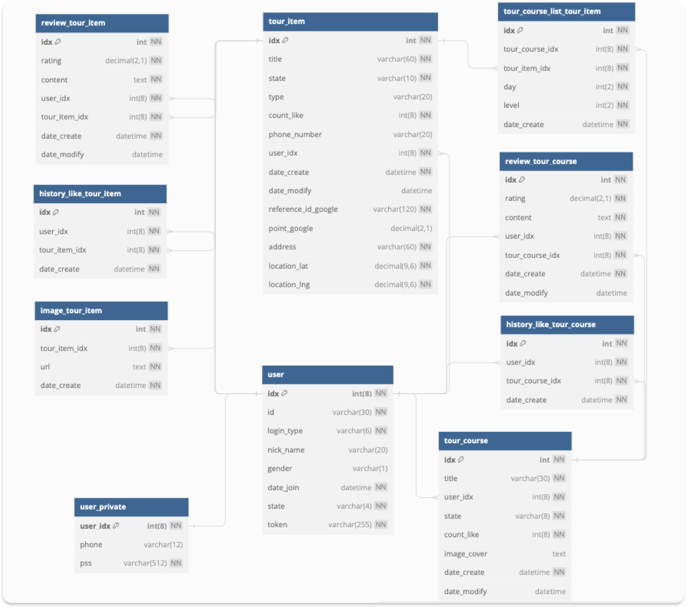

# 
 ODIK 

### 한국 여행 계획 및 계획 공유를 통한 여행 가이드 애플리케이션

### 
김용찬 김경은 김승은 심연화

### 주요 기능
- 관광지 및 관광 코스 추천
- 관광지 및 관광 코스 검색
- 관광지 담기
- 관광 코스 짜기
- 관광지 또는 관광코스에 댓글 및 좋아요 달기

### 개발 환경
| 백엔드                          | 프론트엔드                 | 데이터베이스                         | 서버         | 배포             | 협업도구                                              |
|------------------------------|-----------------------|--------------------------------|------------|----------------|---------------------------------------------------|
| Java 17 Springboot 3.1.2 | Flutter Dart  | Mysql Redis Amazon RDS | Amazon EC2 | Docker DNS | Jira  Git Discord Google Spread sheet |

### ERD 

### 서비스 구성
#### 홈
| 서비스         | URL |
|-------------|-----|
| 코스 및 관광지 추천 |     |
| 인기검색어       |     |
| 검색          |     |
| 장바구니 이동     |     |
###
#### 검색
| 서비스                | URL |
|--------------------|-----|
| 해당 검색어가 포함된 코스 정보  |     |
| 해당 검색어가 포함된 관광지 정보 |     |
| 관광지 장바구니에 담기       |     |
###
#### 관광지 상세
| 서비스          | URL |
|--------------|-----|
| 관광지 장바구니에 담기 |     |
| 댓글 남기기       |     |
###
#### 코스 상세
| 서비스               |URL|
|-------------------|-----|
| 다른 사람의 계획 일정 확인하기 | |
| 코스 전체 장바구니에 담기    | |
| 특정 관광지 장바구니에 담기   | |
| 댓글 달기 | |
|이동 수단에 따라 이동 시간 확인하기| |

###
#### 장바구니
| 서비스                       |URL|
|---------------------------|-----|
| 장바구니에 담은 관광지 확인하기         ||
| 관광지 순서 재배치를 통한 관광 코스 설계하기 ||
| 공유하기                      ||

